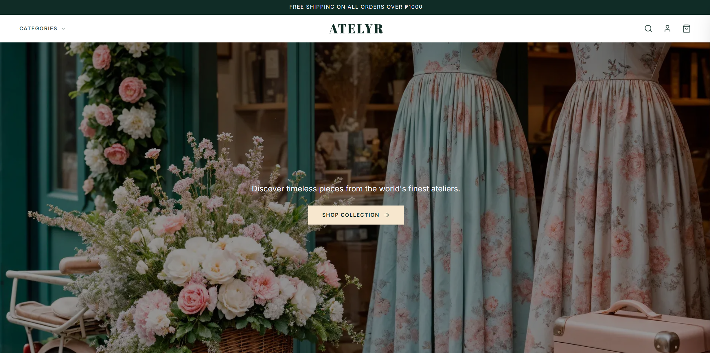
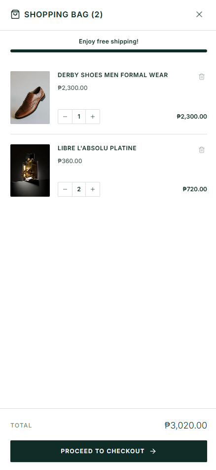
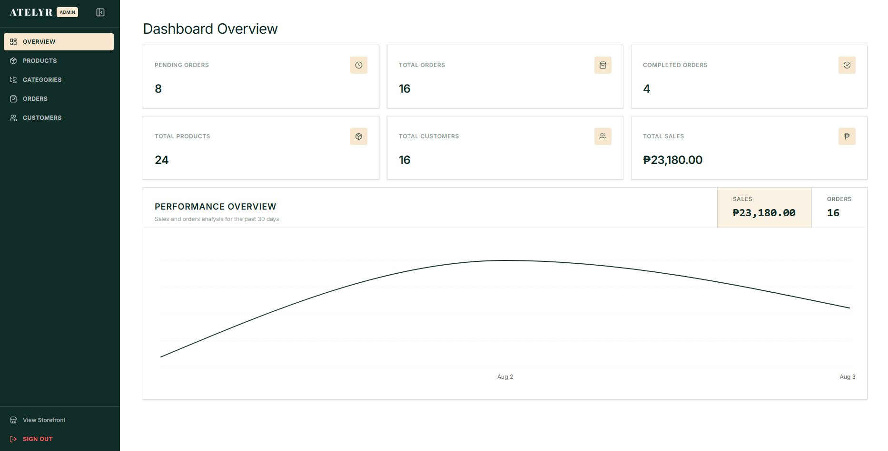

# ATELYR - E-Commerce Web Application

ATELYR is a full-stack, quiet luxury e-commerce web application featuring a Customer Storefront and an Admin Dashboard. Built with Next.js, TypeScript, Tailwind CSS, shadcn/ui, and Supabase.

- **Live Application**: [https://atelyr.vercel.app](https://atelyr.vercel.app)
- **Hosted on**: Vercel

## Technical Stack

- **Framework**: Next.js
- **Language**: TypeScript
- **Styling**: Tailwind CSS
- **UI Components**: shadcn/ui & Lucide Icons
- **Backend & Database**: Supabase (PostgreSQL, Auth, Storage)
- **State Management**: Zustand (with localStorage persistence)

## Screenshots

### Customer Storefront - Desktop


### Mobile Storefront & Shopping Cart
| Mobile View | Shopping Cart |
| :---: | :---: |
|  |  |

### Product Catalog


### Admin Dashboard Overview


## Supabase Database Setup on your local machine

### Step 1: Create a Supabase Project

1. Create a new project and retrieve your Project URL and Publishable API Key from Supabase.

### Step 2: Run Database Schema

1. Run [`supabase/schema.sql`](./supabase/schema.sql) into the Supabase SQL Editor.
2. This creates the `categories`, `products`, `orders`, `order_items`, and `profiles` tables, foreign keys, indexes, RLS policies, auto-profile trigger, and the `products` storage bucket.

### Step 3: Run Database Seed
2. Run [`supabase/seed.sql`](./supabase/seed.sql) into the Supabase SQL Editor.
3. This seeds sample luxury categories, category cover images, sample products, and creates your default Admin account (`admin@atelyr.com`).

## Environment Configuration

Create a `.env.local` file in the project root:

```env
NEXT_PUBLIC_SUPABASE_URL=https://your-project-id.supabase.co
NEXT_PUBLIC_SUPABASE_PUBLISHABLE_KEY=your-supabase-publishable-key
```

## Installation & Running Locally

1. Install dependencies:

   ```bash
   npm install
   ```

2. Run development server:

   ```bash
   npm run dev
   ```

3. Open [http://localhost:3000](http://localhost:3000) in your browser.

## Admin Credentials

- **Admin Login URL**: [http://localhost:3000/admin/login](http://localhost:3000/admin/login)
- **Email**: `admin@atelyr.com`
- **Password**: `admin123456`


## Implementation

### A. Customer Website

1. **Home Page (`/`)**
   - Store logo and navigation bar with cart drawer trigger and mobile menu.
   - Optimized Hero section with high-quality hero image and CTA button.
   - Shop by Category showcase slider with custom category cover images.
   - Dynamic Featured Products Grid showing recently added products.
   - Brand footer with social links, store links, and newsletter subscription.

2. **Product Listing Page (`/[category]`)**
   - Displays products with product image, name, price, category, and action buttons.
   - Search by product name (`?search` URL parameter synced).
   - Price range filtering (`?min` and `?max` URL parameter synced).
   - Price and sales sorting (Sort by Most Sales, Price: Low to High, Price: High to Low).
   - Mobile Responsive product grid.

3. **Product Details View (`/[category]/[product]`)**
   - Breadcrumb navigation.
   - Full product image preview, title, price, category, and description accordion.
   - Real-time stock count.
   - Interactive quantity selector and Add to Cart button.
   - Related products grid based on category matching.

4. **Shopping Cart (`CartDrawer`)**
   - Persistent client cart state using Zustand and `localStorage`.
   - Side drawer allowing quantity updates, item removal, subtotal calculation, and total amount calculation.
   - Free Shipping progress bar with real-time progress update.
   - Direct link to checkout.

5. **Checkout Page (`/checkout`)**
   - Customer checkout form requiring Name, Email, Contact Number, Delivery Address, Payment Method, and optional Order Notes.
   - Supported payment methods: Cash on Delivery (COD), E-Wallet, and Bank Transfer.
   - Instant order creation in Supabase with auto-generated UUID order numbers.
   - Order confirmation view displaying order ID, customer summary, purchased items, and total amount.

### B. Admin Dashboard

1. **Admin Authentication (`/admin/login`)**
   - Secure login form authenticated against Supabase Auth.
   - Role-based authorization: checks user role in `public.profiles` (`role = 'admin'`). Non-admin users are automatically denied access.

2. **Dashboard Overview (`/admin`)**
   - Summary cards displaying key business metrics: Total Products, Total Orders, Pending Orders, Completed Orders, Total Customers, and Total Sales revenue.
   - Interactive sales revenue and order volume line chart (`AdminOverviewChart`) powered by Recharts.

3. **Product Management (`/admin/products`)**
   - Full CRUD management: View, Add, Edit, and Delete products.
   - Product search bar and category/status filter controls.
   - Product statuses: `Active`, `Inactive`, `Out of Stock`.
   - Image file upload directly to Supabase Storage (`products` bucket).
   - Delete confirmation modal before removing any product.
   - Pagination (10 items per page).

4. **Category Management (`/admin/categories`)**
   - Full CRUD management: View, Add, Edit, and Delete categories.
   - Custom category cover image upload support.
   - Safety checks preventing deletion if a category currently has assigned products.
   - Integrated search bar and pagination (10 items per page).

5. **Order Management (`/admin/orders`)**
   - Order table displaying Order ID, Customer Name, Order Date, Payment Method, Total Amount, and Order Status.
   - Filter Popover for status and payment method filters.
   - Inline order status updater dropdown.
   - Integrated search bar and pagination (10 items per page).

6. **Order Details Page (`/admin/orders/[id]`)**
   - Comprehensive breakdown showing Order Number, Customer Info, Contact, Delivery Address, Payment Method, Order Status, Ordered Items table with unit prices, Subtotal, Total Amount, and Customer Notes.

7. **Customer Management (`/admin/customers`)**
   - Directory listing all customers with Customer Name, Email, Contact Number, Total Orders Count, Total Purchase Amount, and Account Status.
   - Filtered to exclude administrator accounts.
   - Integrated search bar and pagination (10 items per page).

## Other Features Implemented

- **Product & Category Image Uploads**: Upload image files directly to Supabase Storage.
- **Sales & Order Analytics Chart**: Custom interactive Recharts line graph in Admin Overview graphing revenue and order volume.
- **Pagination**: Standardized 10 items per page pagination using custom UI components across product listings and admin tables
- **Role-Based Admin Security**: Security Definer functions and RLS policies in PostgreSQL.
- **Url-Synced Filters**: Search query, price filters, and category selections persist seamlessly across page refreshes and navigation.

## System Flow & Data Sync

1. **Product Changes**: When an administrator adds a product, edits a price, or changes a product status to `inactive` in the Admin Dashboard, the changes immediately reflect on the Customer Storefront.
2. **Order Submission**: When a customer places an order at `/checkout`, the order details and order items are inserted into Supabase. The order immediately appears in the Admin Order Management table.
3. **Status Updates**: When an admin updates an order status from `Pending` to `Completed`, sales revenue counters and customer total spend metrics update automatically.
